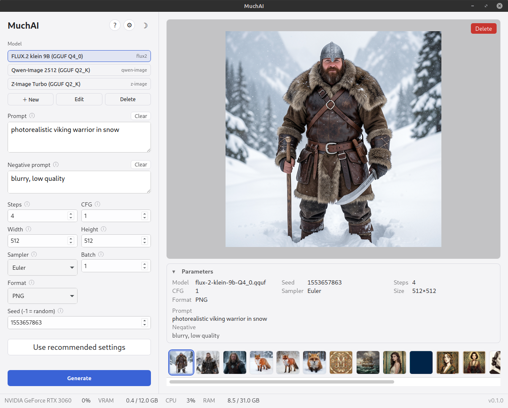
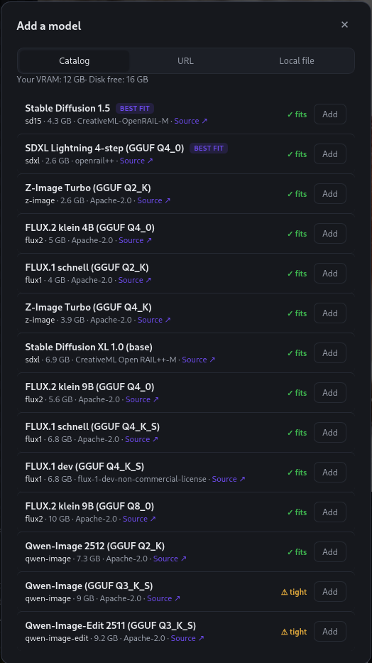
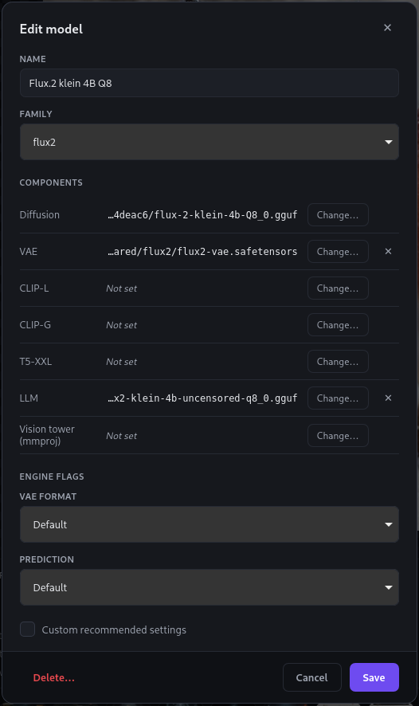
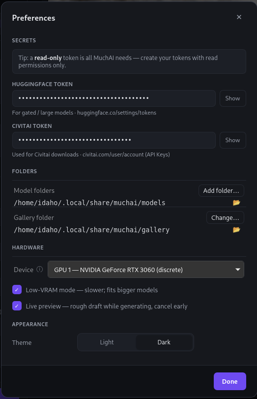

# MuchAI

**Make images from text, right on your own machine.**

MuchAI is a local, offline text-to-image desktop app. It wraps
[stable-diffusion.cpp](https://github.com/leejet/stable-diffusion.cpp) in a
simple GUI: pick a model, type a prompt, press Generate. Nothing leaves your
computer.


## Motivation
My goal was to bring an application to Linux that was just as “simple” as 
[DrawThings](https://drawthings.ai) for macOS and Windows.

During development, it became clear that relying solely on models from 
HuggingFace or Civitai wouldn’t be so easy, and that it places greater 
demands on users in terms of their knowledge of the models. However, a model 
catalog could be helpful to get started.

Support for LoRA and instruction-based editing has since landed. ControlNet is
still planned ;)


## Features

- **Text-to-image generation**, fully local and offline.
- **Model library with curated downloads** — hardware-aware starter models rated
  for your VRAM, plus paste-a-URL for your own.
- **Instruction editing** — drop in a photo, say what to change ("make the sky
  stormy"), and get that change rather than a fresh picture. Edit the result
  again to keep refining.
- **Live preview** — watch a rough draft form as it generates, so you can cancel
  early when the composition is wrong.
- **Runs on GPU or CPU** — Vulkan backend across NVIDIA / AMD / Intel, with a CPU
  fallback.
- **Live resource monitor** — GPU / VRAM / CPU / RAM usage while you work.
- **Dark and light themes.**

## Screenshots

| | |
|---|---|
| <br>Main window (light theme) | <br>Add a model from the curated catalog or a URL |
| <br>Edit a model's components and defaults | <br>Preferences |

## Requirements

- Linux x86_64.
- A Vulkan-capable GPU (NVIDIA / AMD / Intel) — or run on CPU (slower).
- glibc 2.38 or newer.

## Install

### Download (recommended)

Grab the latest `muchai_*_amd64.AppImage` from the
[Releases](https://github.com/idahomst/muchai/releases) page, make it
executable, and run it:

```bash
chmod +x muchai_*_amd64.AppImage
./muchai_*_amd64.AppImage
```

### Build from source

Prerequisites: a [Rust toolchain](https://www.rust-lang.org/tools/install),
[Node.js](https://nodejs.org) (18+), and the system libraries Tauri needs
(WebKitGTK etc. — see the [Tauri Linux setup guide](https://tauri.app/start/prerequisites/)).

```bash
npm install
bash scripts/fetch-engine.sh   # downloads the pinned stable-diffusion.cpp engine
npm run tauri dev              # run in development
# or build a release AppImage:
bash scripts/build-appimage.sh
```

## A note on models

MuchAI runs open model weights that each carry **their own license** — some are
restricted to non-commercial use. MuchAI does not grant you any rights to the
models; respecting each model's license is your responsibility.

## Acknowledgements

- **Image engine:** [stable-diffusion.cpp](https://github.com/leejet/stable-diffusion.cpp)
  by leejet & contributors — the Vulkan/ggml engine that renders every image.
- **Built with:** [Tauri](https://tauri.app), [Svelte](https://svelte.dev),
  [Vite](https://vite.dev), and [Rust](https://www.rust-lang.org).
- **Models:** thanks to [Hugging Face](https://huggingface.co) and its community
  for the open models MuchAI can download and run.
- **Inspired by:** [Draw Things](https://drawthings.ai) and
  [Neural-Pixel](https://github.com/Luiz-Alcantara/Neural-Pixel).
- **Developed by:** Claude Opus (Anthropic) — designed & built with Claude, for
  Martin Stepanek.

## License

[MIT](LICENSE) © 2026 Martin Stepanek.
