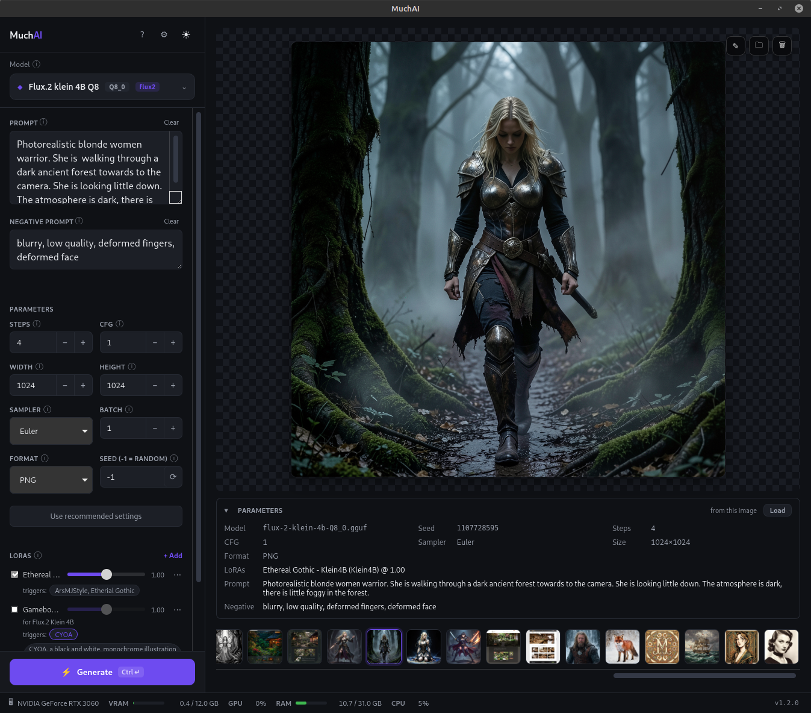

# Making your first picture

MuchAI makes pictures from a written description. It runs entirely on your own
computer — nothing you type and nothing you make is sent anywhere. Before it can
draw anything you need to download a **model**, which is the part that does the
actual drawing. This guide walks you through your first picture from an empty
window to a finished image.

## The window



There is a lot on screen at once, so here is the same window with the detail
stripped out:

```
┌──────────────┬────────────────────────────┐
│ Model        │                            │
│ Prompt       │      your picture          │
│ Parameters   │      appears here          │
│ LoRAs        │                            │
│ [ Generate ] │  ── earlier pictures ──    │
├──────────────┴────────────────────────────┤
│ what your computer is doing right now     │
└───────────────────────────────────────────┘
```

Everything you change is on the left. Everything you make is on the right. The
strip along the bottom shows how hard your computer is working; you can ignore
it entirely. So can you ignore **Parameters** and **LoRAs** for now — the first
is a set of dials with sensible values already in them, and the second is an
optional add-on that nudges a model towards a particular style. Neither is
needed for your first picture.

## Step 1 — Get a model

A model is a large file that knows how to draw. MuchAI does not come with one,
because each is several gigabytes and no single model suits everyone.

At the top left, under **Model**, click the model box and then **＋ Add…**. The
**Catalog** tab lists models that are known to work, and each row carries a small
badge telling you how it will do on *your* computer:

- **✓ fits** — comfortable. Pick one of these for your first picture.
- **⚠ tight** — it will run, but slowly, and it may struggle.
- **✗ 14 GB** — too big for your graphics card. The number is what you would be
  downloading.

Click **Download** on a row that says **✓ fits**. This takes a while — you are
downloading gigabytes — but you do it once per model, not once per picture. You
can close the dialog and the download keeps going.

A bigger model is not automatically a better picture. The small ones are fast,
and fast means you can try ten ideas in the time a large model spends on one.

## Step 2 — Describe your picture

The **Prompt** box is where you say what you want. Being specific works far
better than being poetic:

- `a dog` — you will get *a* dog, but not one you chose.
- `a golden retriever puppy on a beach` — better. Now the breed and the place
  are yours.
- `a golden retriever puppy on a beach at sunset, warm light, photograph` — best.
  You have said what it is, where it is, when it is, and what kind of picture it
  should look like.

Subject, setting, lighting, style. Any of them you leave out, the model chooses
for you.

Below it is the **Negative prompt**, for things you do *not* want — `blurry`,
`text`, `extra fingers`. It can stay empty, and for many of the newer, faster
models it is simply ignored, so an empty box is often the right answer rather
than a missed opportunity. The ⓘ beside the box tells you whether the model you
picked pays attention to it.

## Step 3 — Press Generate

**Generate** is the large button at the bottom of the left column. The little
`Ctrl ↵` on it means you can press Ctrl and Enter together instead.

A bar shows the progress. While it works, a rough draft of your picture appears
and sharpens step by step — an early draft looking blotchy and strange is normal,
not a broken picture. If it is clearly heading somewhere you do not want, press
**Cancel** and change your description. You have lost nothing but the time.

## Where your pictures go

Every finished picture is saved automatically and joins the strip below the
large one. Click any of them to bring it back.

The buttons above the picture let you open the folder it was saved in, or delete
it. Deleting moves the file to your system Trash, so a mistake is recoverable.

Each picture also remembers every setting that made it. Select an older picture
and press **Load**, next to the words *from this image*, and all of those
settings come back — the way to make another picture like one you liked, instead
of trying to remember what you typed.

## Changing a photo you already have

MuchAI can also alter a picture you give it, but only with a model built for
that job. An ordinary model cannot do it. In the catalog, that is
**Qwen-Image-Edit**.

Once such a model is selected, an **Image to edit** panel appears above the
prompt. Drop your photo onto it, or click to choose a file. The **Prompt** box
becomes **Instruction**, and this is where nearly everyone goes wrong the first
time:

> Describe the **change**, not the finished picture.
>
> "Make the sky stormy" changes the sky and leaves your photo alone.
>
> "A house under a stormy sky" is a description of a whole picture, so that is
> what you get — a brand-new house that is not yours.

Editing is much slower than making a picture from nothing; a single edit can
take several minutes. Start with a small change and see what you get before
committing to a long one.

## When it is slow, or does not work

**It is slow.** If you have no graphics card, MuchAI runs on your main processor
instead. This works, and it is very slow — minutes rather than seconds. Nothing
is wrong.

**A model will not fit.** MuchAI tells you before you download, with the
**✗** badge in the catalog. Believe it and choose a smaller one.

**If your computer has Intel built-in graphics *and* a separate graphics card,
choose the separate card** in **Preferences → Hardware → Device**. Making
pictures on Intel built-in graphics can freeze your whole computer and force you
to restart it. This is a fault in the Intel graphics driver, not something
MuchAI can detect, fix, or work around — the only reliable protection is not
selecting it. If Intel built-in graphics is all you have, use the **CPU** option
instead and accept that it will be slow.

## Getting help without leaving this page

The small **ⓘ** next to almost every setting explains that setting in one
sentence. Click it. That is the fastest way to learn what anything does, and you
never have to leave the app.

Press **F1** at any time for the help panel, which lists the keyboard shortcuts
and links to this guide and the longer one.

When you are comfortable here, [Getting more out of MuchAI](guide-advanced.md)
covers choosing between model families, fitting a large model into a small
graphics card, LoRAs, and the settings this guide left alone.
